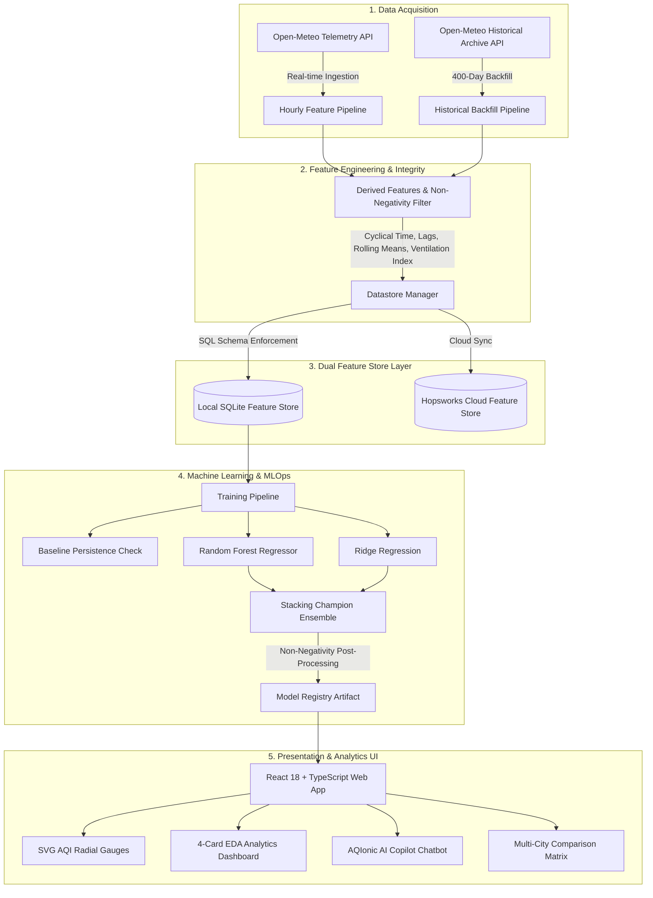

# AQIonic - Air Quality Intelligence Platform

## Run the Vercel submission dashboard

https://aqionic-aqi-predictor.vercel.app/
<br><br>
## overview:
<br><br>


## Run the Streamlit submission dashboard

```powershell
streamlit run streamlit_app.py
```
https://aqionicaqipredictor-cefpyinxjymwsmmpjqqtga.streamlit.app/
<br><br>
## overview:
<br><br>


The Streamlit dashboard mirrors the React navigation and visual language: the dashboard/72-hour forecast, AI Copilot, city comparison, EDA, model benchmarks, feature store, SHAP what-if simulator, and health advisories. Run the Flask API separately with `python app.py`.
## Internship Report:
[Final_AQIonic_Internship_Report .pdf](https://github.com/user-attachments/files/31875480/Final_AQIonic_Internship_Report.pdf)

> **Production-Grade MLOps and data science Platform for Atmospheric Telemetry Ingestion, 1+ Year Feature Engineering, Dual Feature Stores (SQLite & Hopsworks Cloud), Stacking Champion Ensemble Modeling, and Real-Time Air Quality Analytics.**

---

## Executive Overview

**AQIonic** (Air Quality Intelligence) provides predictive modeling and exploratory analytics for Air Quality Index (AQI) forecasts (1-hour, 24-hour, and 72-hour ahead) across major metropolitan regions (Karachi, Lahore, Islamabad, Quetta, Peshawar, and global cities).

The system integrates real-time Open-Meteo telemetry APIs, a **400-day (~9,600+ hourly observations)** archival backfill pipeline, a **Dual Storage Feature Store** (SQLite local storage + Hopsworks Cloud Feature Group), a **Stacking Ensemble Machine Learning Model ($R^2 = 0.8010$)**, and an interactive **React 18 + TypeScript + Vite** web dashboard.

---

## System Architecture



---

## Key Features

- **1+ Year Training Dataset**: Ingests **400 days (9,624+ hourly observations)** to capture annual weather dynamics (monsoon washouts vs. winter inversion smog).
- **Dual Feature Store Strategy**: Operates seamlessly on a **Local SQLite Feature Store** (`data/feature_store.db`) with support for **Hopsworks Cloud Feature Store** (`aqi_pridector` project).
- **Stacking Champion Ensemble**: Combines Ridge Regression and Random Forest Regressors into a Stacking Meta-Regressor achieving **$R^2 = 0.8010$** and reducing RMSE by **>79%** over the baseline.
- **Non-Negativity Guarantee**: Enforces mathematical bounds $\text{AQI} = \max(0, \text{value})$ across feature pipelines, datastore writes, model predictions, and UI visualizers.
- **Modern Web Interface**: Built with React 18, Vite, TypeScript, and Tailwind CSS:
  - **SVG Radial Gauges**: High-contrast gauges with category badges and forecast pills.
  - **4-Card EDA Dashboard**: Time-series line chart, pollutant distribution histogram, weather vs. AQI heatmap, and seasonal box plots.
  - **AQIonic AI Copilot**: Conversational chatbot for natural-language weather & AQI queries.
  - **Multi-City Comparison**: Side-by-side comparative views, leaderboards, and bar charts across cities.

---

## Technology Stack

| Component                   | Technologies Used                                                                                |
| :-------------------------- | :----------------------------------------------------------------------------------------------- |
| **Frontend UI**             | React 18, TypeScript, Vite, Tailwind CSS, Lucide Icons, Recharts                                 |
| **Backend & Pipeline**      | Python 3.12, Pandas, NumPy, Requests, Scikit-Learn, Joblib                                       |
| **Feature Store**           | SQLite3 (Local Store), Hopsworks Python SDK 5.0.6 (Cloud Store)                                  |
| **Security & SSL**          | `pyjks`, `javaobj-py3`, `pycryptodomex`, `pyasn1`, `pyasn1-modules` (Pure-Python JKS Extraction) |
| **Orchestration & Testing** | Apache Airflow (`dags/airflow_dag.py`), GitHub Actions CI/CD, Pytest                             |

---

## Machine Learning Model Benchmarks

Models evaluated on **9,631 hourly observations** (Karachi atmospheric dataset):

| Model Name                     | Root Mean Squared Error (RMSE) | Mean Absolute Error (MAE) | $R^2$ Score |         Beats Baseline?         | Non-Negative Guarantee |
| :----------------------------- | :----------------------------: | :-----------------------: | :---------: | :-----------------------------: | :--------------------: |
| **Baseline Persistence**       |             48.22              |           43.98           |   -3.7287   |            Baseline             |     Pass ($\ge 0$)     |
| **Ridge Regression**           |             12.98              |           9.21            |   0.6572    |             **Yes**             |     Pass ($\ge 0$)     |
| **Random Forest Regressor**    |             10.21              |           7.00            |   0.7878    |             **Yes**             |     Pass ($\ge 0$)     |
| **Stacking Champion Ensemble** |            **9.89**            |         **6.46**          | **0.8010**  | **Yes (+79% RMSE improvement)** |     Pass ($\ge 0$)     |

---

## Local Setup & Installation Guide

### Prerequisites

- **Python 3.12+**
- **Node.js 18+** and `npm`
- _Optional_: Hopsworks Cloud Account & API Key

---

### Step 1: Clone Repository & Navigate

```bash
git clone https://github.com/your-org/AQIonic.git
cd AQIonic
```

---

### Step 2: Set Up Python Virtual Environment

```bash
# On Windows PowerShell:
python -m venv venv
.\venv\Scripts\Activate.ps1

# On Linux / macOS:
python3 -m venv venv
source venv/bin/activate
```

---

### Step 3: Install Python & Node.js Dependencies

```bash
# Install Python ML and Feature Store dependencies:
pip install -r requirements.txt

# Install Node.js dependencies for Frontend:
npm install
```

---

### Step 4: Configure Environment Variables

Create or update the `.env` file in the root directory:

```env
# Optional Hopsworks Cloud Configuration
HOPSWORKS_API_KEY=your_hopsworks_api_key_here
HOPSWORKS_PROJECT=aqi_pridector

# Gemini AI API Key for UI Copilot (if using Gemini AI Studio)
GEMINI_API_KEY=your_gemini_api_key_here
```

---

### Step 5: Execute Pipelines

#### 1. Ingest 1+ Year Historical Backfill Dataset (400 Days / 9,600+ Hours)

```bash
python pipelines/historical_backfill.py
```

_Outputs backfilled hourly records into local SQLite (`data/feature_store.db`) and Hopsworks Cloud Feature Store._

#### 2. Train ML Models & Save Champion Model

```bash
python pipelines/training_pipeline.py
```

_Trains Baseline, Ridge, Random Forest, and Stacking Champion Ensemble models. Saves champion model artifact to `models/best_aqi_model.pkl`._

#### 3. Run Real-Time Hourly Feature Pipeline

```bash
python pipelines/feature_pipeline.py
```

_Fetches live Open-Meteo telemetry and updates feature store tables._

---

### Step 6: Run Automated Integration Tests

```bash
python -m pytest tests/test_pipelines.py
```

_Verifies baseline model beating, non-negativity guarantees, and datastore schema health._

---

### Step 7: Launch Web Application

```bash
npm run dev
```

Open your browser and navigate to `http://localhost:5173`.

---

## 📁 Directory & File Structure

```
AQIonic/
├── data/                       # Local SQLite Feature Store & Temp Files
│   └── feature_store.db
├── dags/                       # Apache Airflow Pipeline Orchestration
│   └── airflow_dag.py
├── models/                     # Trained Machine Learning Model Artifacts
│   └── best_aqi_model.pkl
├── pipelines/                  # MLOps & Data Processing Pipelines
│   ├── datastore.py            # Local SQLite & Hopsworks Cloud Sync Manager
│   ├── feature_pipeline.py     # Hourly Telemetry & Feature Engineering
│   ├── historical_backfill.py  # 400-Day Historical Data Backfill
│   └── training_pipeline.py    # Model Training, Validation & Registry
├── src/                        # React 18 + TypeScript Application
│   ├── components/             # UI Components (Gauges, EDA, Copilot, City Comparison)
│   ├── services/               # API & Telemetry Data Services
│   ├── App.tsx                 # Main Application Layout & Tab Router
│   └── index.css               # Design System Tokens & Utility Styles
├── tests/                      # Pytest Automated Test Suite
│   └── test_pipelines.py
├── .env                        # Environment Configuration
├── package.json                # Frontend Package Manifest
├── README.md                   # System Documentation
└── requirements.txt            # Python Package Manifest
```

---

## Troubleshooting & FAQs

### 1. Hopsworks Cloud Sync Permission Warnings

If `historical_backfill.py` displays a warning like:
`[HOPSWORKS WARNING] Cloud sync failed (No valid scope found for this invocation. Valid scope is: [KAFKA])`

- **Resolution**: Go to [Hopsworks Account -> API Keys](https://eu-west.cloud.hopsworks.ai/account/api-keys), edit your API Key, and ensure the **`KAFKA`**, **`DATASET_CREATE`**, and **`FEATURE_STORE`** checkboxes are enabled.

### 2. Running Without Hopsworks API Key

- The platform operates **100% locally** out of the box using the local SQLite feature store (`data/feature_store.db`). Hopsworks Cloud API Key is strictly optional.

---

## 📄 License & Credits

Built with Love by the **Laiba Ashfaq**. Powered by Open-Meteo APIs, Scikit-Learn, Hopsworks, React, and Vite.
